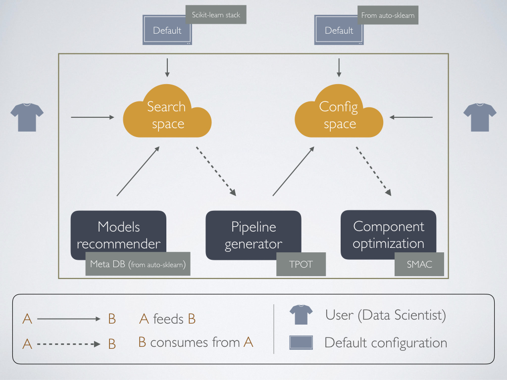

# auto-ml: automated machine learning

## Overview

The Automated Machine Learning process is intented to automatically discover
well performant pipelines that solve a machine learning problem such as
classification or regression.

Achmea's solution is developed in python using scikit-learn as a baseand and 
makes use of features from different state-of-art libraries to solve the next
business problems:

1. Given a new dataset, the Data Scientist may want to fine-tune the
hyper-parameters of the model he alreday knows solves the problem accurately.
2. Given a new dataset, the Data Scientst has no clue of which algorithms may
perform well so he/she wants to explore the options for the given dataset.
3. Given a new dataset, the Data Scientits wants to automatically discover a
machine learning pipeline solving the problem accurately.

In the current repository you will find a set of `README.md` files explaining
the code structure and highlights of the solution but you may want to start by
finishing reading this README first.

## Understanding the dependencies

TODO: Explain each of the libraries

## Architecture

Figure below depicts the architecture of the solution. Understanding this will
ease your understanding of the code structure so it comes worth to start by
explaining the behaviour that can be easily associated to the image.

By **default** in auto-ml, the output pipelines consider the whole set of algorithms
defined in scikit-learn and it is cosidered to be the default **search space**.
However, this search space can be reduced **manually** (i.e. programatically
specify the models to use following TPOT's conventions) or **automatically** 
(i.e. use auto-ml's assistant to search for potential models by looking into
similar datasets in the so called Meta Knowledge Databaset). These operations
will output a scikit-learn pipeline.

On the other hand, it is also possible that the Data Scientist wants to skip
this automated discovery of a pipeline and uses its own pipeline object.
Regardless of where a pipeline object is coming from, we can use SMAC to
optimize the hyper-parameters involved by using a so called
**configuration space**. The configuration space is used to specify the
hyper-parameters playing a role in the model together with their tuning ranges,
i.e., the intervals for their values. These intervals are **pre-defined** using
auto-sklearn's results but can also be **manually** specified by the user.

The user can interact with any of the components in the architecture, meaning
that it can **request for search space suggestions**, **generate pipelines**
using these suggestions (or not) and **optimize a given pipeline**.



## Using auto-ml

A simple example of how to use all components of this python package is shown
in the snippet below.

```python
# The required auto-ml imports
from automl.discovery.assistant import Assistant
from automl.datahandler.dataloader import DataLoader
from automl.bayesianoptimizationpiepeline.base \
    import BayesianOptimizationPipeline

# Get a dataset from OpenML using the auto-ml's DataLoader
dataset = DataLoader.get_openml_dataset(openml_id=179, problem_type=0)

# Create instance of the assistance, pointing to the dataset
assistant = Assistant(dataset)

# Compute similar datasets
similar_datasets, similarity_measures = assistant.compute_similar_datasets()
print("Similar datasets", similar_datasets)
print("Similar datasets", similarity_measures)

# Output the resulting reduced search space (from the similarities)
red_ss = assistant.reduced_search_space

# Retrieving the suggested classifiers
print("classifiers:", red_ss.classifiers)

# Optionally, you can obtain more than classifiers

# print("encoders:", red_ss.encoders)
# print("rescalers:", red_ss.rescalers)
# print("preprocessors:", red_ss.preprocessors)
# print("imputations:", red_ss.imputations)

# Pipeline generation using TPOT
print("Generating pipeline...")
pipeline_obj = assistant.generate_pipeline()

# Save TPOT's generated pipeline
pipeline_obj.save_pipeline(target_dir="results")

# Run bayestian optimization
pipeline = pipeline_obj.pipeline
bayesian = BayesianOptimizationPipeline(
    dataset,
    pipeline,
    optimize_on="quality",
    iteration=20)

# Retrieve the result from the bayesian optimization
score, opt_pipeline = bayesian.optimize_pipeline()

# Prive bayesian's score
print("Score", score)
print(opt_pipeline)

# Compare both results
print("TPOT: {} vs. Bayesian: {}".format(
    pipeline_obj.validation_score,
    score
))
```

## Notes

- Currently, no sparse data is supported
- Meta-suggestions are restricted to classification problems only.

## Authors

- f.a.ansari@student.tue.nl
- j.gomez.robles@student.tue.nl

## On-site point of contact

- l.vink@achmea.nl