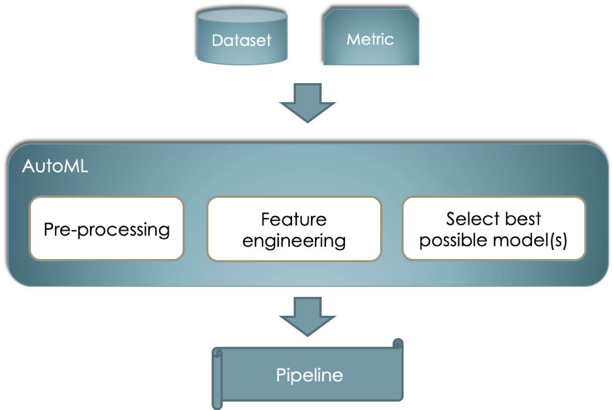

AutoML in a nutshell
===================================

---------
 Overview
---------

In Machine Learning (ML) different approaches can be followed to solve a given
problem, such as classification, regression, clustering, etc. Despite of the
nature of this problem, a recurrent question when working on it is:
*which algorithm should I use to come up with the best possible solution?* The
answer to this question is not always immediate and for non-experts or
non-experienced machine learning practicioners it may become a cumbersome and
exhausting task. In essence, Automated Machine Lerning (AutoML) tries to give a
solution for this task.

Particularly, when working with traditional ML such as classification,
the problem can be understood as in the following below. This is, given a
datset and a metric to optimize on (e.g. accuracy, roc_auc, etc.) we would like
to find a so called *pipeline* that may include data pre-processors, feature
engineering algorithms and the best possible models (note the plural) that all
together work as good as possible for the input.

Given this overview, we could come up with the next questions:

- Is it really possible to automate the selection of a "good" Machine Learning pipeline for any given problem?
- What if we just want to focus on a portion of the pipeline (e.g., just the model's hyperparameters optimization)?
- How can we help data scientists to learn from this automated selection?

These answers are the main focus of our work that can be consulted in more detail
in section :doc:`solution`.

-------------------------------
 Note: AutoML for Deep Learning
-------------------------------

Because of the different nature of Deep Learning (DL) - where hyper-parameters are
continously recomputed during training - with respect to traditional ML - where
parameters are static during all the training phase -, one cannot generalize the
problem up to this level of abstraction. Hence, different techniques are used
such as the ones proposes by *TODO*.