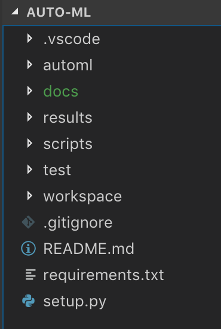

Python basics to understand the tool
====================================

**auto-ml** has been developed in python and it relies on scikit-learn's classes
and functions to achieve its goals. In case you are not familiar with python,
this page will guide you trough the basics so that you can use or contribute
to the tool.

Python
------
Python is a 'genera purpose' programming language. This is, contrarely to R it
gives more flexibility for the type of problems it solves, such as web
development, scripting (similar to bash) or scientific programming. The ability
to use it for one purpose or the other is given by the 'packages' (or library,
in other languages) that are imported (or extended) by the programmer. 

Some important characteristics are:

* Gives a high important to indentation
* Can behave as a scripting language or follow an object-oriented programming paradigm.
* Types are dynamic
* Versions 2.x and 3.x (Python 2.x is legacy, Python 3.x is the present and future of the language)
* To install packages a tool named **pip** has been developed (e.g. pip install mypackage)

A python package
----------------

A python package is composed by modules. For reference, look a the image below.

For now, you can forget about the directories **.vscode**, **results**,
**scripts**, **workspace**.

* **automl**: This is the name of the package and store the sources, when importing some code from the library you will refer by this name. E.g.: `import automl.myclass`
* **docs**: Where the documentation is stored.
* **test**: Directory containing unit tests for the package.
* **requirements.txt**: A file containing the packages that are required by the package.
* **setup.py**: The script to run when you use the **pip** tool to install the package.

Additionally, an **examples** directory is recommended to store quick examples
for the users of how to run your code.

Python's docstrings
-------------------
A python docstring is a string within the function. In python this convention is
strongly followed to keep good software engineering practices.

.. code-block:: python
   :name: docstring

    def function(argument1=None):
        """
        Example of a function

        Args:
            argument1 (str): The argument. Defaults to None.

        Returns:
            bool: True or false on a given criteria
        """
        
        return true

A full guide to docstrings used in auto-ml package can be found in docs/README.md

Python code style
-----------------
Python is intended to keep good software engineering practices such as naming,
indentation, casing, etc. For this, a main tool has been developed and it is
available for different IDEs: pytlint.

More information can be found here: https://www.pylint.org/

Additionally, following the PEP8 doc convention is advised: https://www.python.org/dev/peps/pep-0008/

The `scipy` package
--------------------------

SciPy (pronounced “Sigh Pie”) is a Python-based ecosystem of open-source
software for mathematics, science, and engineering.

The principal packages in this ecosystem are: 
* numpy: to achieve easy matrix manipulation as in R.
* matplotlib: To plot similarly to MatLab's plotting tool.
* pandas: To provide high-performance, easy-to-use data structures and data analysis tools.

The `numpy` package
-------------------

NumPy is the fundamental package for scientific computing with Python.
It contains among other things:

* A powerful N-dimensional array object.
* Tools for integrating C/C++ and Fortran code.
* Useful linear algebra, Fourier transform, and random number capabilities.

Besides its obvious scientific uses, NumPy can also be used as an efficient
multi-dimensional container of generic data. Arbitrary data-types can be
defined. This allows NumPy to seamlessly and speedily integrate with a wide
variety of databases.

A set of examples can be found in 
https://docs.scipy.org/doc/numpy-1.15.1/user/quickstart.html, but the next code
snippet shows a bit of the power of the package.

.. code-block:: python
   :name: numpy-example

    import numpy as np

    A = np.array([[1,1], [0,1]])
    B = np.array([[2,0], [3,4]])

    A * B # elementwise product
    # Output: array([[2, 0], [0, 4]])
    
    A @ B # matrix product
    # Output: array([[5, 4], [3, 4]])

    A.dot(B) # another matrix product
    # Output array([[5, 4], [3, 4]])

The `pandas` package
--------------------

Intended to ease the manipulation of dataframes (such as for data cleaning). A
short tutorial to pandas can be found in
https://pandas.pydata.org/pandas-docs/stable/10min.html

However, some of the highlights we would like to present are:

.. code-block:: python
   :caption: Loading a csv file
   :name: pandas-01

    import pandas as pd
    import numpy as np

    data = pd.read_csv("train.csv", index_col="Loan_ID")

.. code-block:: python
   :caption: Sorting by columns
   :name: pandas-02

    import pandas as pd
    import numpy as np

    data.sort_values(['ApplicantIncome','CoapplicantIncome'], ascending=False)

.. code-block:: python
   :caption: Quick plots
   :name: pandas-03

    import pandas as pd
    import numpy as np

    import matplotlib.pyplot as plt
    %matplotlib inline
    data.boxplot(column="ApplicantIncome",by="Loan_Status")

.. code-block:: python
   :caption: Remove a column
   :name: pandas-04

    import pandas as pd
    import numpy as np

    data.drop(['ApplicantIncome', 'CoapplicantIncome'], axis=1)

The `scikit-learn` package
--------------------------

Simple and efficient tools for data mining and data analysis. Contains a wide
variety of objects for Machine Learning. A list of complete models available
can be found in http://scikit-learn.org/stable/modules/classes.html

.. code-block:: python
   :caption: Pipeline example
   :name: scikit-01

    from sklearn.pipeline import Pipeline
    from sklearn.preprocessing import StandardScaler
    from sklearn.linear_model import LogisticRegression

    # add your data here
    X_train, X_test, Y_train, Y_test = make_my_dataset()

    # it takes a list of tuples as parameter
    pipeline = Pipeline([
        ('scaler', StandardScaler()),
        ('clf', LogisticRegression())
    ])

    # use the pipeline object as you would
    # a regular classifier
    pipeline.fit(X_train,y_train)

    y_preds = pipeline.predict(X_test)